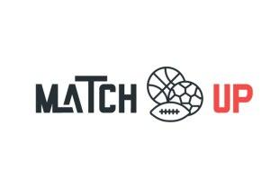

# MatchUp

[Match Up](https://ecarlos7ma.wixsite.com/website) es una aplicación para la conexión de personas con intención de realizar deporte con otra gente para socializar e interaccionar en una plataforma sencilla, útil e intuitiva.

Hoy en día son comunes las aplicaciones que sirven para conectar a gente. Esta propuesta va dirigida a conectar a gente de cara a realizar diferentes deportes. La idea no consiste exclusivamente en conectar a gente sino que además permite crear un determinado partido con una ubicación, hora, nivel de dificultad y número de jugadores restantes.

Cualquier usuario que lo desee puede solicitar unirse y el administrador del partido (la persona que lo creó) puede aceptar o rechazar a dicho usuario, basándose en distintas valoraciones como actitud, nivel, etc. En este contexto la aplicación podría parecerse a BlaBlaCar. Del mismo modo existiría la posibilidad de que centros deportivos creasen partidos o torneos de algún deporte y ellos mismos realizaran la gestión de los equipos y las reservas de pistas propias.

Los autores de este trabajo son: 

* [Pablo Alfaro Goicoechea](https://github.com/pabloalfaro).
* [Carlos Morales Aguilera](https://github.com/Carlosma7).
* [Carlos Santiago Sánchez Muñoz](https://github.com/Carlossamu7).

### Entregas

El proyecto se ha descompuesto en una serie de entregas a medida que este avanza, entre las cuales se distinguen:

1. [Descripción general del proyecto](https://github.com/Carlosma7/MatchUp/tree/main/Practica1): Contiene el proceso de brainstorming inicial, descripción del proyecto, canvas, estudio de mercado y mapa conceptual del mismo.
2. [Visión del proyecto](https://github.com/Carlosma7/MatchUp/tree/main/Practica2): Contiene el documento de visión del proyecto y documentos de escenarios y personajes relativos al proyecto, y diagrama de casos de uso.
3. [Diseño y desarrollo del proyecto](https://github.com/Carlosma7/MatchUp/tree/main/Practica3), el cual se descompone en dos etapas:
    1. [Primera iteración](https://github.com/Carlosma7/MatchUp/tree/main/Practica3/Iteracion1): Contiene la descripción del proceso de iteraciones, bocetos de baja fidelidad y modelado en JustInMind, además de los diagramas de conceptos, HTA, wireflow y documentos de arquitectura de la información.
    2. [Segunda iteración](https://github.com/Carlosma7/MatchUp/tree/main/Practica3/Iteracion2): Contiene la actualización correspondiente a la segunda etapa en los diagramas de conceptos, HTA y wireflow, además del documento de arquitectura de la información actualizado. Contiene también los bocetos de baja fidelidad y alta fidelidad y los prototipos en JustInMind.
4. [Lanzamiento del proyecto](https://github.com/Carlosma7/MatchUp/blob/main/Practica4.pdf): Contiene una breve documentación sobre la página de lanzamiento y el repositorio donde se guarda la información del proyecto.
